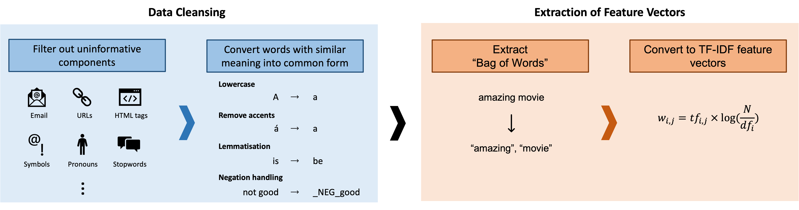
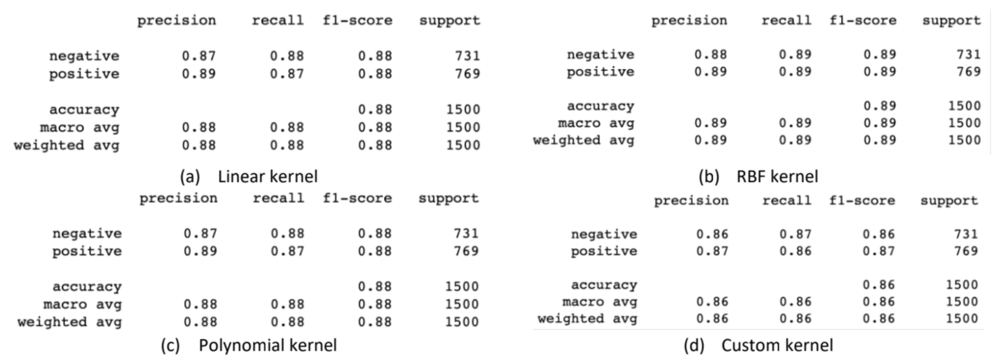

# Movie Review Sentiment Prediction with SVM and Boosting

This is a coursework for CM50265 Machine Learning 2 (Semester 2, 2022) at the University of Bath.

## Objective

The goal of this coursework is to solve a NLP task of movie review sentiment prediction (positive/negative). The data is a subset of the [IMDB movie reviews dataset](http://ai.stanford.edu/~amaas/data/sentiment/).

The final report can be found [here](https://github.com/sskyau/svm-boosting/blob/master/Final%20Report.pdf).

## Data Preprocessing

Prior to model development, a series of preprocessing steps are taken to clean and extract the most meaningful vocabularies to be processed by the models. 

## Model 1: SVM

Three different SVM kernels (linear, RBF, polynomial, and histogram intersection) are explored and evaluated. After hyperparameter tuning, it is found that the SVM model with RBF kernel achieves the best testing accuracy of 89%. 

Detailed analysis of the performance can be found in the report.

## Model 2: AdaBoost

The final AdaBoost model is developed by combining 10,000 weak decision stump classifiers of depth 1. The final testing accuracy achieved by the model is 85%. 

In-depth analysis of the performance is detailed in the report.
